# BÁO CÁO PHÂN TÍCH & BẢN VẼ SCHEMA CƠ SỞ DỮ LIỆU CHÍNH DỰ ÁN LOONGGYM

Tài liệu này trình bày bản vẽ và phân tích chi tiết cấu trúc thực thể cơ sở dữ liệu (ERD) của hệ thống **LoongGym** được biên soạn và chuẩn hóa trực tiếp từ file `schema.prisma`. 

Tương tự như cấu trúc thiết kế từ dự án tham khảo của bạn (có phân chia rõ ràng các khối chức năng như Phân quyền, Công ty & Tuyển dụng, CV & Ứng tuyển, Chat, Thông báo), hệ thống cơ sở dữ liệu LoongGym cũng được phân tách một cách mạch lạc thành **8 khối nghiệp vụ cốt lõi**.

---

## 1. PHÂN LOẠI CÁC BẢNG THEO PHÂN HỆ NGHIỆP VỤ

Hệ thống cơ sở dữ liệu LoongGym bao gồm các nhóm bảng chính sau:

```
┌────────────────────────────────────────────────────────────────────────┐
│                                LOONGGYM                                │
├───────────────────┬───────────────────┬────────────────────────────────┤
│ 1. Người dùng     │ 2. Bài tập        │ 3. Giáo án mẫu                 │
│    - users        │    - exercises    │    - workout_programs          │
│    - user_profile │    - muscle_groups│    - workout_program_days      │
│    - user_settings│    - equipment    │    - workout_templates         │
│                   │    - ex_muscles   │    - workout_temp_exercises    │
├───────────────────┼───────────────────┼────────────────────────────────┤
│ 4. Lịch & Nhật ký │ 5. Dinh dưỡng     │ 6. Cửa hàng số                 │
│    - user_plans   │    - nutrition_tgt│    - products                  │
│    - user_plan_day│    - food_items   │    - product_categories        │
│    - sessions     │    - meal_logs    │    - carts & cart_items        │
│    - session_exes │    - meal_log_item│    - orders & order_items      │
│    - workout_sets │    - body_metrics │    - payments                  │
├───────────────────┴───────────────────┴────────────────────────────────┤
│ 7. Cộng đồng & Tương tác                                               │
│    - community_posts, post_media, post_comments, post_reactions        │
├────────────────────────────────────────────────────────────────────────┤
│ 8. Trợ lý ảo AI Coach                                                  │
│    - ai_conversations, ai_messages, ai_recommendations                 │
└────────────────────────────────────────────────────────────────────────┘
```

---

## 2. BẢN VẼ SƠ ĐỒ THIẾT KẾ CƠ SỞ DỮ LIỆU (DATABASE DESIGN ERD)

Dưới đây là sơ đồ thiết kế cơ sở dữ liệu chính của hệ thống LoongGym. Sơ đồ được chia nhóm và tô màu sắc theo các phân hệ chức năng tương tự như mẫu tham chiếu bạn cung cấp, thể hiện rõ các trường Khóa chính (PK), Khóa ngoại (FK) và mối quan hệ số lượng (1 : 1, 1 : N) bằng tiếng Việt.

### 2.1. Sơ đồ Thiết kế phân hệ màu sắc (Bảng chính rút gọn)


---

### 2.2. Mã nguồn sơ đồ thiết kế (Mermaid Flowchart)
Bạn có thể sao chép mã nguồn dưới đây để chỉnh sửa cấu trúc bản vẽ:

```mermaid
flowchart TD
    %% ==========================================
    %% THIẾT LẬP PHONG CÁCH MÀU SẮC (CSS STYLE CLASSES)
    %% ==========================================
    classDef userTable fill:#e3f2fd,stroke:#1565c0,stroke-width:1.5px,color:#0d47a1;
    classDef workoutTable fill:#f3e5f5,stroke:#7b1fa2,stroke-width:1.5px,color:#4a148c;
    classDef logsTable fill:#e8f5e9,stroke:#388e3c,stroke-width:1.5px,color:#1b5e20;
    classDef nutritionTable fill:#fff8e1,stroke:#f57c00,stroke-width:1.5px,color:#e65100;
    classDef storeTable fill:#fce4ec,stroke:#c2185b,stroke-width:1.5px,color:#880e4f;
    classDef legendStyle fill:#fafafa,stroke:#9e9e9e,stroke-width:1px,color:#424242;

    %% ==========================================
    %% KHỐI 1: HỆ THỐNG NGƯỜI DÙNG & CẤU HÌNH (ĐỎ)
    %% ==========================================
    subgraph MODULE_USER ["👤 CẤU TRÚC NGƯỜI DÙNG & HỒ SƠ (USER & CONFIG)"]
        users["<b>users</b><hr/>🔑 id (PK)<br/>email<br/>passwordHash<br/>role (Enum)<br/>status (Enum)<br/>createdAt<br/>updatedAt"]
        user_profile["<b>user_profile</b><hr/>🔑 id (PK)<br/>🔗 userId (FK)<br/>fullName<br/>gender<br/>heightCm<br/>weightKg<br/>calorieGoal<br/>totalWorkoutDays"]
        user_settings["<b>user_settings</b><hr/>🔑 id (PK)<br/>🔗 userId (FK)<br/>language<br/>unitSystem<br/>theme"]
    end
    class users,user_profile,user_settings userTable;
    style MODULE_USER fill:#ffffff,stroke:#e53935,stroke-width:3px;

    %% ==========================================
    %% KHỐI 2: THƯ VIỆN & GIÁO ÁN MẪU (XANH DƯƠNG)
    %% ==========================================
    subgraph MODULE_WORKOUT ["💪 THƯ VIỆN & GIÁO ÁN MẪU (PROGRAMS & TEMPLATES)"]
        exercises["<b>exercises</b><hr/>🔑 id (PK)<br/>name<br/>slug (Unique)<br/>difficulty<br/>exerciseType<br/>estimatedCalories"]
        workout_programs["<b>workout_programs</b><hr/>🔑 id (PK)<br/>title<br/>slug (Unique)<br/>goal<br/>difficulty<br/>price"]
        workout_program_days["<b>workout_program_days</b><hr/>🔑 id (PK)<br/>🔗 programId (FK)<br/>title<br/>cycleDay"]
        workout_templates["<b>workout_templates</b><hr/>🔑 id (PK)<br/>🔗 programDayId (FK)<br/>title<br/>estimatedDurationMinutes"]
    end
    class exercises,workout_programs,workout_program_days,workout_templates workoutTable;
    style MODULE_WORKOUT fill:#ffffff,stroke:#1e88e5,stroke-width:2.5px;

    %% ==========================================
    %% KHỐI 3: THEO DÕI TẬP LUYỆN CÁ NHÂN (XANH LÁ)
    %% ==========================================
    subgraph MODULE_LOGS ["📅 THEO DÕI TẬP LUYỆN THỰC TẾ (TRAINING LOGS)"]
        user_training_plans["<b>user_training_plans</b><hr/>🔑 id (PK)<br/>🔗 userId (FK)<br/>🔗 programId (FK)<br/>title<br/>startDate<br/>status"]
        workout_sessions["<b>workout_sessions</b><hr/>🔑 id (PK)<br/>🔗 userId (FK)<br/>🔗 planDayId (FK)<br/>title<br/>startedAt<br/>endedAt<br/>durationSeconds<br/>status"]
        workout_session_exercises["<b>workout_session_exercises</b><hr/>🔑 id (PK)<br/>🔗 workoutSessionId (FK)<br/>🔗 exerciseId (FK)<br/>status"]
        workout_sets["<b>workout_sets</b><hr/>🔑 id (PK)<br/>🔗 sessionExerciseId (FK)<br/>setNumber<br/>setType<br/>reps<br/>weightKg<br/>isCompleted"]
    end
    class user_training_plans,workout_sessions,workout_session_exercises,workout_sets logsTable;
    style MODULE_LOGS fill:#ffffff,stroke:#43a047,stroke-width:2.5px;

    %% ==========================================
    %% KHỐI 4: DINH DƯỠNG & SỨC KHỎE (VÀNG)
    %% ==========================================
    subgraph MODULE_NUTRITION ["🥗 DINH DƯỠNG & SỨC KHỎE (NUTRITION & METRICS)"]
        nutrition_targets["<b>nutrition_targets</b><hr/>🔑 id (PK)<br/>🔗 userId (FK)<br/>targetDate (Unique)<br/>caloriesTarget<br/>proteinGTarget<br/>carbsGTarget<br/>fatGTarget"]
        meal_logs["<b>meal_logs</b><hr/>🔑 id (PK)<br/>🔗 userId (FK)<br/>mealDate<br/>mealType"]
    end
    class nutrition_targets,meal_logs nutritionTable;
    style MODULE_NUTRITION fill:#ffffff,stroke:#ffb300,stroke-width:2.5px;

    %% ==========================================
    %% KHỐI 5: CỬA HÀNG SẢN PHẨM SỐ & ĐƠN HÀNG (TÍM)
    %% ==========================================
    subgraph MODULE_STORE ["🛒 CỬA HÀNG & ĐƠN HÀNG (STORE & ORDERS)"]
        products["<b>products</b><hr/>🔑 id (PK)<br/>title<br/>slug (Unique)<br/>productType<br/>price<br/>status"]
        orders["<b>orders</b><hr/>🔑 id (PK)<br/>🔗 userId (FK)<br/>orderNumber (Unique)<br/>status<br/>subtotal<br/>total"]
        order_items["<b>order_items</b><hr/>🔑 id (PK)<br/>🔗 orderId (FK)<br/>🔗 productId (FK)<br/>productTitle<br/>quantity<br/>unitPrice<br/>totalPrice"]
    end
    class products,orders,order_items storeTable;
    style MODULE_STORE fill:#ffffff,stroke:#8e24aa,stroke-width:2.5px;

    %% ==========================================
    %% BẢNG CHÚ THÍCH (LEGEND)
    %% ==========================================
    legend["<b>CHÚ THÍCH</b><hr/>🔑 PK : Primary Key (Khóa chính)<br/>🔗 FK : Foreign Key (Khóa ngoại)<br/>1 : Một (One)<br/>N : Nhiều (Many)<br/>── : Quan hệ kết nối"]
    class legend legendStyle;

    %% ==========================================
    %% QUAN HỆ KẾT NỐI (RELATIONSHIPS WITH CARDINALITY)
    %% ==========================================
    %% Quan hệ trong Khối 1
    users -- "1 : 1" --> user_profile
    users -- "1 : 1" --> user_settings

    %% Kết nối từ Khối 1 sang các Khối khác
    users -- "1 : N" --> user_training_plans
    users -- "1 : N" --> workout_sessions
    users -- "1 : N" --> meal_logs
    users -- "1 : N" --> nutrition_targets
    users -- "1 : N" --> orders

    %% Quan hệ trong Khối 2
    workout_programs -- "1 : N" --> workout_program_days
    workout_program_days -- "1 : N" --> workout_templates

    %% Kết nối từ Khối 2 sang Khối 3
    workout_programs -- "1 : N" --> user_training_plans

    %% Quan hệ trong Khối 3
    user_training_plans -- "1 : N" --> workout_sessions
    workout_sessions -- "1 : N" --> workout_session_exercises
    workout_session_exercises -- "1 : N" --> workout_sets

    %% Kết nối từ Khối 2 sang Khối 3 (Bảng trung gian)
    exercises -- "1 : N" --> workout_session_exercises

    %% Quan hệ trong Khối 5
    orders -- "1 : N" --> order_items
    products -- "1 : N" --> order_items
```



---

## 3. CHI TIẾT CÁC BẢNG CHÍNH & MỐI QUAN HỆ ĐẶC TRƯNG

### 3.1. Phân hệ Luyện tập & Theo dõi thực tế (Workout Execution & Logs)
Đây là phân hệ phức tạp nhất trong hệ thống LoongGym, liên kết giáo án mẫu của huấn luyện viên/hệ thống với kết quả tập thực tế của người dùng:

1. **Từ Giáo án mẫu đến Lịch trình cá nhân**:
   - Một `workout_programs` (chương trình tập) chứa nhiều `workout_program_days` (ngày tập, ví dụ: Đẩy - Kéo - Chân).
   - Khi người dùng đăng ký tham gia chương trình, hệ thống sinh ra một bản ghi `user_training_plans` gắn với `users`.
   - Mỗi ngày trong lịch tập cá nhân tương ứng với một `user_training_plan_days` chứa ngày cụ thể (`scheduledDate`) và trạng thái (`status: pending, completed, skipped`).

2. **Từ Lịch trình cá nhân đến Buổi tập thực tế**:
   - Khi người dùng bấm nút "Bắt đầu tập" trên ứng dụng, hệ thống tạo một `workout_sessions` ghi lại thời gian bắt đầu, kết thúc, năng lượng tiêu hao.
   - Buổi tập này có thể liên kết trực tiếp với lịch ngày `user_training_plan_days` hoặc là một buổi tập tự do (không theo kế hoạch, khi đó `planDayId` sẽ là `null`).
   - Trong mỗi buổi tập, người dùng thực hiện nhiều bài tập (`workout_session_exercises`), mỗi bài tập bao gồm nhiều hiệp nâng tạ (`workout_sets`).
   - Mối quan hệ từ `workout_session_exercises` tới `workout_sets` là quan hệ **1 - Nhiều (1:N)**. Đây là nơi lưu trữ dữ liệu cốt lõi để phân tích tiến trình tăng tạ (Progressive Overload) của người dùng.

### 3.2. Phân hệ Thương mại Điện tử Sản phẩm số (Digital E-Commerce)
Tương tự như cấu trúc giỏ hàng & đơn hàng của các dự án thương mại điện tử chuyên nghiệp:
- `carts` lưu trạng thái giỏ hàng hiện tại của người dùng. Khi thanh toán thành công, giỏ hàng được làm trống hoặc cập nhật trạng thái.
- `orders` lưu vết hóa đơn với các trường bắt buộc như `orderNumber` (mã số đơn hàng độc nhất để đối soát thanh toán), `subtotal`, `discountTotal`, và `total`.
- `order_items` là bảng trung gian lưu vết danh sách sản phẩm được mua trong đơn hàng đó. Bảng này nhân bản trường `productTitle` và `unitPrice` từ bảng `products` tại thời điểm mua để đảm bảo dữ liệu hóa đơn lịch sử không bị thay đổi khi quản trị viên cập nhật thông tin sản phẩm sau này.
- `payments` liên kết trực tiếp với `orders` (1:N hoặc 1:1 tùy theo phương thức thanh toán) để theo dõi các nỗ lực thanh toán qua ví điện tử (Momo, VNPay, Stripe) và lưu kết quả phản hồi (`rawResponse`) phục vụ đối soát lỗi.

### 3.3. Phân hệ Mạng xã hội & Cộng đồng (Social Community)
Hỗ trợ tối đa tương tác giữa các học viên:
- `community_posts` liên kết với `users` (quan hệ N:1) và có liên kết tùy chọn `relatedWorkoutSessionId` tới `workout_sessions` (quan hệ N:1) cho phép người dùng chia sẻ nhanh kết quả của buổi tập vừa hoàn thành lên bảng tin cộng đồng.
- `post_comments` hỗ trợ cấu trúc tự liên kết (Self-relation) qua trường `parentCommentId` để tạo cấu trúc cây bình luận (Comment - Reply lồng nhau giống Facebook/Reddit).
- `user_follows` là một bảng liên kết nhiều-nhiều (N:N) tự liên kết trên bảng `users` (`followerId` và `followingId` đều là khóa ngoại trỏ về `users.id`) dùng để xây dựng luồng tin (Newfeed) dựa trên những người mà thành viên theo dõi.

---

## 4. BÀI HỌC THIẾT KẾ RÚT RA TỪ DỰ ÁN THAM KHẢO

Dựa trên sơ đồ dự án tham khảo bạn cung cấp (bên có hệ thống Dynamic Permission và Tuyển dụng), chúng tôi áp dụng những tư duy thiết kế tối ưu sau vào LoongGym:

1. **Ràng buộc khóa ngoại nghiêm ngặt & Cơ chế Cascade**:
   - Tất cả các bảng hồ sơ con như `user_profile`, `user_settings`, `carts` đều sử dụng khóa ngoại trỏ về `users.id` với thuộc tính `onDelete: Cascade`. Khi tài khoản người dùng bị xóa, tất cả dữ liệu cá nhân liên quan sẽ tự động được dọn dẹp sạch sẽ để tránh rác cơ sở dữ liệu.
   
2. **Thiết kế phẳng cho dữ liệu lịch sử**:
   - Tương tự như cách lưu trữ thông tin CV ứng tuyển từ dự án tham khảo (lưu link trực tiếp tại thời điểm nộp thay vì trỏ động), hệ thống đơn hàng `order_items` của LoongGym copy trực tiếp tiêu đề và giá bán sản phẩm từ bảng `products`. Điều này đảm bảo tính toàn vẹn tài chính cho các báo cáo doanh thu kế toán.
   
3. **Phân tách Module rõ ràng thông qua Mapping tên bảng**:
   - Các bảng trong schema đều được map tên dạng số nhiều viết thường (`users`, `user_profile`, `workout_sessions`, `community_posts`) giống phong cách chuẩn của các hệ thống cơ sở dữ liệu lớn, giúp việc viết câu lệnh SQL thuần hoặc sử dụng các công cụ Query Builder bên ngoài Prisma trở nên dễ dàng và đồng bộ.
