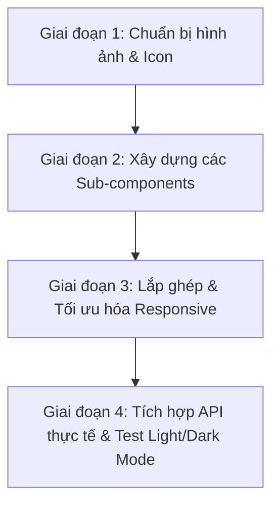

# KẾ HOẠCH THIẾT KẾ & TRIỂN KHAI GIAO DIỆN TRANG CHỦ (HOMEPAGE REDESIGN)

Tài liệu này hoạch định kế hoạch chi tiết để tái cấu trúc và xây dựng giao diện Trang chủ (`src/pages/home/index.jsx`) của dự án **LoongMilkGym** theo thiết kế cao cấp từ ảnh mẫu, tích hợp chế độ Sáng/Tối (Light/Dark Mode).

---

## 1. PHÂN TÍCH CẤU TRÚC GIAO DIỆN TRANG CHỦ

Giao diện trang chủ mới sẽ được chia thành **10 phần chính** từ trên xuống dưới, đảm bảo tính thẩm mỹ, hiện đại và tối ưu trải nghiệm người dùng:

| STT | Phần giao diện | Vai trò & Trải nghiệm |
|---|---|---|
| **1** | **Header / Navigation Bar** | Thanh điều hướng chính, logo "MILK", nút đăng ký/đăng nhập và nút chuyển đổi giao diện Sáng/Tối (`ThemeToggle`). |
| **2** | **Hero Section** | Tiêu đề ấn tượng ("Tập luyện thông minh. Sống mạnh mẽ hơn"), nút kêu gọi hành động, hình ảnh động lực và các nhãn số liệu thống kê nổi (`30+ Bài tập`, `12 Lộ trình`). |
| **3** | **Weekly Stats Preview** | Grid 4 thẻ hiển thị nhanh số liệu (Phút tập, Calo, Số buổi, Giờ ngủ) dưới dạng biểu đồ cột mini. |
| **4** | **Popular Exercises** | Danh sách bài tập phổ biến dưới dạng Grid thẻ bài tập có ảnh chất lượng cao, tên bài tập, lượng calo tiêu thụ và nút xem nhanh. |
| **5** | **Muscle Group Goals** | Bộ lọc trực quan bằng danh sách biểu tượng các nhóm cơ (Ngực, Lưng, Vai, Tay, Chân, Bụng, Cardio) dẫn link đến thư viện bài tập. |
| **6** | **Recommended Programs** | Thẻ giới thiệu 3 lộ trình gợi ý nổi bật (Push Day, Pull Day, Leg Day) kèm các thông số thời gian, độ khó và nút bắt đầu. |
| **7** | **Featured HIIT Banner** | Banner dài giới thiệu bài tập đặc biệt (HIIT 30') kích thích người dùng click tham gia nhanh. |
| **8** | **Weekly Progress & Medals** | Khung hiển thị trực quan biểu đồ cột tiến độ hàng tuần và khu vực huy hiệu thành tựu đạt được. |
| **9** | **Testimonial Quote** | Banner trích dẫn tạo động lực tập luyện trên nền ảnh vận động viên mạnh mẽ. |
| **10**| **Footer** | Chân trang chứa liên kết nhanh, thông tin thương hiệu và đăng ký nhận tin bản tin email. |

---

## 2. QUY CHUẨN THIẾT KẾ & HỖ TRỢ CHẾ ĐỘ SÁNG/TỐI (LIGHT/DARK MODE)

Giao diện sẽ tuân thủ nghiêm ngặt hệ thống Token màu sắc có sẵn của dự án trong `src/index.css`. Cụ thể:

### Hệ màu sắc (Color Tokens):
*   **Màu chủ đạo (Primary):** `#ccff00` (Xanh chuối neon). Ở chế độ tối, màu này hiển thị rực rỡ; ở chế độ sáng, nó được phối hợp nhẹ nhàng hoặc có viền tối để tăng độ tương phản.
*   **Nền (Background):**
    *   *Chế độ tối (Dark Mode):* Nền chính `var(--bg-color)` là `#121212`, nền phụ/thẻ `var(--bg-secondary)` là `#1a1a1a`.
    *   *Chế độ sáng (Light Mode):* Nền chính là `#ffffff`, nền phụ/thẻ là `#f3f4f6` (xám nhạt sạch sẽ).
*   **Chữ (Typography):**
    *   *Chế độ tối:* Chữ chính `var(--text-color)` là `#f9fafb`, chữ phụ `var(--text-muted)` là `#9ca3af`.
    *   *Chế độ sáng:* Chữ chính là `#111827`, chữ phụ là `#6b7280`.
*   **Đường viền (Border):**
    *   *Chế độ tối:* `var(--border-color)` là `#2a2a2a`.
    *   *Chế độ sáng:* `var(--border-color)` là `#e5e7eb`.

---

## 3. THIẾT KẾ CÁC REACT COMPONENTS DỰ KIẾN

Trang chủ sẽ được xây dựng theo kiến trúc modular hóa thành các Sub-components đặt trong thư mục `src/pages/home/components/`:

```
src/pages/home/
├── index.jsx                     # Component cha quản lý layout & dữ liệu
└── components/
    ├── HeroSection.jsx           # Banner đầu trang, nút kêu gọi hành động
    ├── WeeklyStatsPreview.jsx    # 4 thẻ thống kê nhanh kèm mini chart
    ├── PopularExercises.jsx      # Grid danh sách bài tập phổ biến
    ├── MuscleGroupGoals.jsx      # Bộ chọn nhóm cơ tròn có biểu tượng
    ├── RecommendedPrograms.jsx   # Danh sách lộ trình tập gợi ý
    ├── HIITBanner.jsx            # Banner quảng cáo bài HIIT
    ├── ProgressMedals.jsx        # Biểu đồ tiến độ + Thẻ huy hiệu
    └── TestimonialQuote.jsx      # Khung trích dẫn động lực cuối trang
```

### Chi tiết cách hoạt động của từng Component:

1.  **`HeroSection`**:
    *   Sử dụng hình ảnh vận động viên chất lượng cao (lấy từ URL CDN hoặc assets).
    *   Các thẻ badge số liệu `30+ Bài tập` và `12 Lộ trình` sẽ được định vị tuyệt đối (`absolute`) bay lơ lửng trên ảnh với hiệu ứng chuyển động chậm (micro-animation).
2.  **`PopularExercises`**:
    *   Hiển thị các bài tập phổ biến. Mỗi bài tập là một thẻ chứa ảnh, nhãn calo tiêu thụ, tên bài và nút điều hướng tới chi tiết bài tập.
    *   Tích hợp hiệu ứng zoom ảnh nhẹ khi hover và bóng đổ neon mờ ở chế độ tối.
3.  **`MuscleGroupGoals`**:
    *   Sắp xếp danh sách ngang các nút hình tròn đại diện cho các nhóm cơ chính.
    *   Mỗi nút chứa icon trực quan (như cánh tay cho Biceps/Triceps, chân cho Leg, tim cho Cardio). Bấm vào sẽ mở thư viện bài tập đã được lọc theo nhóm cơ đó.
4.  **`RecommendedPrograms`**:
    *   Grid 3 cột mô tả các lộ trình mẫu điển hình.
    *   Thẻ nổi bật (như Push Day) sẽ có viền hoặc nền đặc trưng màu vàng chanh neon (`bg-primary`) để thu hút hành động đăng ký của người dùng.

---

## 4. KẾ HOẠCH TÍCH HỢP DỮ LIỆU & API

Giao diện trang chủ sẽ kết hợp cả dữ liệu động lấy từ API và dữ liệu hiển thị mẫu chất lượng cao:
*   **Bài tập phổ biến**: Sử dụng API Hook `useGetExercisesQuery` với tham số giới hạn (`limit: 6`) để lấy trực tiếp dữ liệu bài tập thực tế từ cơ sở dữ liệu đã seed.
*   **Giáo án mẫu**: Sử dụng API Hook `useGetWorkoutProgramsQuery` với giới hạn (`limit: 3`) để hiển thị các lộ trình gợi ý mới nhất.
*   **Thống kê tuần**: Mẫu dữ liệu mô phỏng tương ứng với các chỉ số của người dùng (nếu đã đăng nhập) để tăng tính cá nhân hóa hoặc hiển thị số liệu mẫu nếu chưa đăng nhập.

---

## 5. LỘ TRÌNH THỰC HIỆN CHI TIẾT



*   **Bước 1**: Chuẩn bị các hình ảnh nền chất lượng cao cho Hero Banner, HIIT Banner và Testimonial qua Cloudinary.
*   **Bước 2**: Code các component con của trang chủ (`HeroSection.jsx`, `PopularExercises.jsx`...) với cấu trúc CSS chuyển đổi linh hoạt theo thuộc tính `data-theme`.
*   **Bước 3**: Cập nhật file `src/pages/home/index.jsx` để lắp ráp tất cả các component con, kiểm tra hiển thị responsive trên Mobile, Tablet và Desktop.
*   **Bước 4**: Kết nối RTK Query để hiển thị dữ liệu bài tập và giáo án thật từ Database. Chạy thử nghiệm chuyển đổi Light/Dark mode trên nhiều thiết bị.
