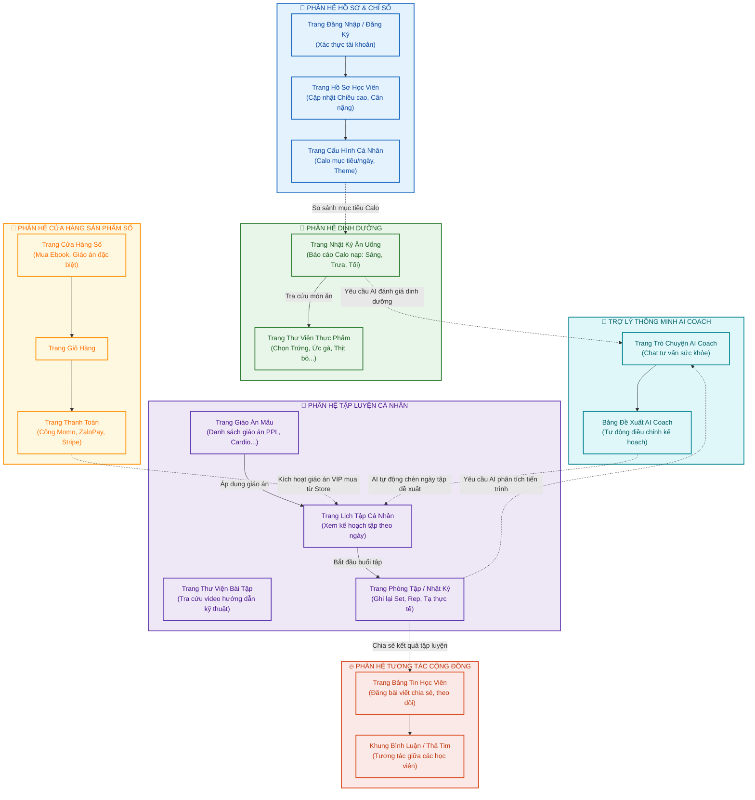

# BÁO CÁO LUỒNG HOẠT ĐỘNG & BẢN ĐỒ CÁC TRANG (LOONGGYM FLOWCHART)

Tài liệu này trình bày bản vẽ sơ đồ luồng hoạt động (User Flow) và cách các trang (Views/Screens) tương tác với nhau trong dự án **LoongGym**, được phân bổ trực quan theo từng phân hệ chức năng bằng tiếng Việt.

---

## 1. SƠ ĐỒ LUỒNG TRANG VÀ HOẠT ĐỘNG TRỰC QUAN

Sơ đồ dưới đây biểu diễn cấu trúc phân trang theo màu sắc của từng phân hệ (tương tự phong cách thiết kế phân khối từ dự án mẫu của bạn), kết hợp với các mũi tên động nét đứt thể hiện luồng chuyển dữ liệu và kích hoạt giữa các phân hệ:

---

## 2. CHI TIẾT CÁC LUỒNG HOẠT ĐỘNG DYNAMIC

### 2.1. Phân hệ Hồ sơ & Cấu hình (Xanh dương)
- Học viên truy cập qua **Trang Đăng Nhập / Đăng Ký** -> tiến tới **Trang Hồ Sơ Học Viên** để cập nhật thông số sinh trắc học cá nhân (Chiều cao, Cân nặng, Cân nặng mục tiêu).
- Từ đây, thiết lập tại **Trang Cấu Hình Cá Nhân** (đặc biệt là Calo mục tiêu/ngày) sẽ được tự động đồng bộ sang phân hệ **Dinh dưỡng** để làm mốc tính toán phần trăm hoàn thành chỉ tiêu calo nạp vào.

### 2.2. Luồng Tập luyện cá nhân (Tím)
- Người dùng có thể tự tra cứu hướng dẫn động tác tại **Trang Thư Viện Bài Tập**.
- Để bắt đầu kế hoạch, người dùng xem danh sách giáo án mẫu tại **Trang Giáo Án Mẫu** và bấm áp dụng để hệ thống tự động rải lịch tập vào **Trang Lịch Tập Cá Nhân** (Calendar).
- Đến ngày tập, người dùng bấm "Bắt đầu tập" để chuyển sang giao diện active **Trang Phòng Tập / Nhật Ký** ghi nhận số set, rep và tạ thực tế.
- **Hoạt động Dynamic**: Sau khi hoàn thành buổi tập và bấm "Lưu", hệ thống sẽ tự động chuyển tiếp dữ liệu và kích hoạt màn hình viết bài đăng chia sẻ lên **Trang Bảng Tin Cộng Đồng**.

### 2.3. Luồng Dinh dưỡng (Xanh lá)
- Học viên ghi lại các món ăn tại **Trang Nhật Ký Ăn Uống** (theo các bữa Sáng, Trưa, Tối, Phụ).
- Trong quá trình nhập, học viên có thể tra cứu nhanh lượng calo/carb/protein của các loại thực phẩm chuẩn từ **Trang Thư Viện Thực Phẩm**.

### 2.4. Luồng Mua sắm & Kích hoạt Giáo án VIP (Vàng)
- Tại **Trang Cửa Hàng Số**, học viên lựa chọn các Ebook dinh dưỡng hoặc các Giáo án tập luyện đặc biệt (được gắn thẻ VIP/Premium).
- Khi thêm sản phẩm vào **Trang Giỏ Hàng** và tiến hành thanh toán thành công tại **Trang Thanh Toán** (thông qua Momo, ZaloPay, Stripe), hệ thống sẽ **tự động kích hoạt** và hiển thị giáo án VIP đó trực tiếp vào **Trang Lịch Tập Cá Nhân** của học viên.

### 2.5. Luồng Trợ lý AI Coach thông minh (Xanh ngọc)
- **AI Coach** hoạt động như một bộ não liên kết tất cả các phân hệ:
  - Dữ liệu tập luyện thực tế thu thập từ **Trang Nhật Ký Tập** được gửi về cho AI để phân tích xu hướng tăng tạ (Progressive Overload).
  - Dữ liệu calo và vĩ chất nạp vào từ **Trang Nhật Ký Bữa Ăn** được gửi về cho AI để đánh giá tỷ lệ dinh dưỡng.
  - Từ phòng **Chat tư vấn AI Coach**, AI sẽ tổng hợp và đưa ra các đề xuất điều chỉnh tại **Bảng Đề Xuất AI**. 
  - **Hoạt động Dynamic**: Nếu học viên bấm "Đồng ý" với đề xuất của AI (ví dụ: giảm số set bài Squat do cơ đùi quá tải, hoặc thêm bữa phụ), AI sẽ **tự động cập nhật trực tiếp** các ngày tập/thực đơn vào **Trang Lịch Tập Cá Nhân** của học viên mà không cần người dùng thao tác thủ công.

---

## 3. MÃ NGUỒN MERMAID FLOWCHART

Bạn có thể chỉnh sửa sơ đồ này trực tiếp bằng cách sao chép mã nguồn Mermaid dưới đây:

